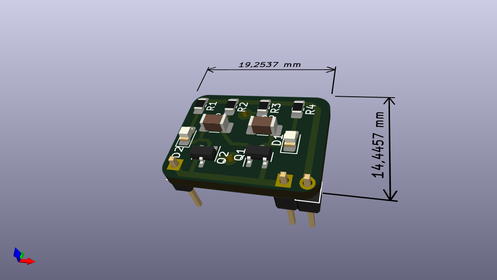
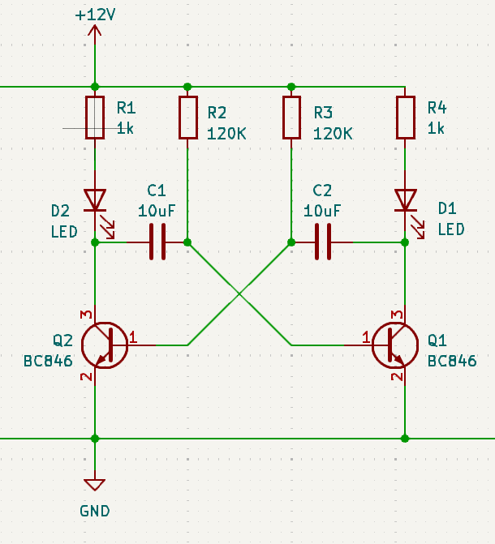

# SMD Transistor Blinker

## BOM

| Component | Value | Supplier | Link |
| ----------- | ------ | ------- | ---------------------------------- |
| Kondensator | 10µF | Mouser | https://www.mouser.at/ProductDetail/Murata-Electronics/GCM31CD71H106KE36L?qs=By6Nw2ByBD1oHD3I3aH59w%3D%3D |
| Widerstand | 1kΩ | Mouser | https://www.mouser.at/ProductDetail/Bourns/CR0805AFX-1001EAS?qs=mAH9sUMRCtuBEx1SCnbzgg%3D%3D |
| Widerstand | 120kΩ | Mouser |https://www.mouser.at/ProductDetail/Bourns/CR0805-JW-124ELF?qs=sGAEpiMZZMukHu%252BjC5l7YeS2YHLDsUik0yZ2uigiNW8%3D |
| LED | RED | Mouser | https://www.mouser.at/ProductDetail/Lumileds/L150-50805006000H0?qs=MyNHzdoqoQIdcy00zd2cLQ%3D%3D |
| Transistor | BC846 | Mouser |https://www.mouser.at/ProductDetail/Nexperia/BC846215?qs=me8TqzrmIYXkX1bWZY2EVg%3D%3D |

## Leiterplatte / PCBA 

## Schaltung / Circuit

## Bauteileerklärung:

### Widerstände:

Ein Widerstand (R1-R4) ist ein elektronisches Bauteil, das den Stromfluss in einem Stromkreis begrenzt oder reguliert. Er wandelt einen Teil der elektrischen Energie in Wärme um und beeinflusst so, wie viel Strom durch einen bestimmten Teil eines Stromkreises fließen kann.

### Kondensator: 

Ein Kondensator (C1 & C2) ist ein elektronisches Bauteil, das elektrische Energie speichert. Er besteht aus zwei leitfähigen Flächen, den sogenannten Platten, die durch ein Isoliermaterial (das Dielektrikum) voneinander getrennt sind. Die Hauptfunktion eines Kondensators ist es, Ladung zu speichern und bei Bedarf wieder abzugeben.

### LED: 

Eine LED (Light Emitting Diode D1 & D2) ist ein elektronisches Bauteil, das Licht erzeugt, wenn elektrischer Strom durch es hindurchfließt.

### Transistor:

Ein Transistor (Q1 & Q2) ist ein elektronisches Bauteil, das als Schalter oder Verstärker fungiert. Er besteht aus Halbleitermaterialien und hat drei Anschlüsse: Emitter, Basis und Kollektor. Transistoren sind sehr wichtig für die Elektronik, da sie den Stromfluss steuern und Verstärkungsfunktionen ermöglichen.

## Schaltungserklärung:

Die Schaltung basiert auf einem Astabilen Multivibrator, der die beiden Transistoren in einem wechselseitigen Betrieb schaltet. Der erste Transistor (Q1) schaltet die erste LED und der zweite Transistor (Q2) schaltet die zweite LED ein und aus. Dabei wechseln sich die LEDs ab, was das typische „Blinken“ erzeugt.

Ein astabiler Multivibrator ist eine elektronische Schaltung, die ständig zwischen zwei Zuständen hin- und herschaltet, ohne eine externe Steuerung. 

Der J1 ist der Eingang, hier wird die Spannung angelegt. Entweder nimmt man zwei polige Stiftleisten oder einfach zwei Drähte.

## Löten:

### Geräte und Materialen:

Lötstadion

Feine Lötspitze für präzises Arbeiten

Lötzinn

Multimeter, das man die Polung und die Größe der Bauteile zuordnen kann

Pinzette

Lötsaugpumpe, Lötsauglitze 

### Ablauf

Sie können dieses HTML Dokument als unterstützung nutzen um hier ihren Fortschritt zu dokumentieren: [BOM](http://htmlpreview.github.io/?https://github.com/GerritMihu/SMT-Transistor-Blinki/blob/main/bom/SMD-Transistor-Blinker-ibom.html)

Lötzinn auf der Platine: Setze eine kleine Menge Lötzinn an einem der Lötpads an, um es vorzubereiten.

Platziere das SMD-Bauteil an der vorgesehenen Stelle auf der Platine mit einer Pinzette. Achte darauf, dass es korrekt ausgerichtet ist (markierte Seiten beachten).

Erhitze das Bauteil: Halte die Spitze des Lötkolbens für ca. 3-10 Sekunden auf das Bauteilbein und das Lötpad. Achte darauf, dass beide Teile warm werden, bevor du das Lötzinn zuführst.

Überprüfe die Lötstelle: Die Lötverbindung sollte glänzend und gleichmäßig sein. Vermeide kalte Lötstellen oder Lötbrücken.

# English:

## Component explanation:

### Resistors:

A resistor (R1-R4) is an electronic component that limits or regulates the flow of current in a circuit. It converts some electrical energy into heat, influencing how much current can flow through a particular part of a circuit.

### Capacitor: 

A capacitor (C1 & C2)is an electronic component that stores electrical energy. It consists of two conductive surfaces, called plates, which are separated from each other by an insulating material (the dielectric). The main function of a capacitor is to store charge and release it when needed.

### LED:

An LED (Light Emitting Diode D1 & D2) is an electronic component that produces light when electric current flows through it.

### Transistor: 

A transistor (Q1 & Q2) is an electronic component that functions as a switch or amplifier. It is made of semiconductor materials and has three connections: emitter, base and collector. Transistors are very important in electronics because they control the flow of current and enable amplification functions.

## Circuit explanation:

The circuit is based on an astable multivibrator that switches the two transistors in alternating operation. The first transistor (Q1) switches the first LED and the second transistor (Q2) switches the second LED on and off. The LEDs alternate, which creates the typical “flashing”.

An astable multivibrator is an electronic circuit that constantly switches between two states without any external control. 

J1 is the input, this is where the voltage is applied. Either you use two-pin pin strips or simply two wires.

## Soldering:

### Equipment and materials:

1. Solderingstation

2. Fine soldering tip for precise work

3. Solder

4. Multimeter, which can be used to determine the polarity and value of the components

5. Tweezers

6. Solder suction pump, solder suction wire

### Soldering on the board:

You can use this dokument to help you with the placement process: [BOM](http://htmlpreview.github.io/?https://github.com/GerritMihu/SMT-Transistor-Blinki/blob/main/bom/SMD-Transistor-Blinker-ibom.html)

Apply a small amount of solder to one of the soldering pads to prepare it.

Place the SMD component in the intended location on the circuit board using tweezers. Make sure it is aligned correctly (note marked sides).

Heat the component: Hold the tip of the soldering iron on the component leg and the soldering pad for approx. 3-10 seconds. Make sure both parts get warm before adding the solder.

Check the solder joint: The solder joint should be shiny and even. Avoid cold solder joints or solder bridges.
